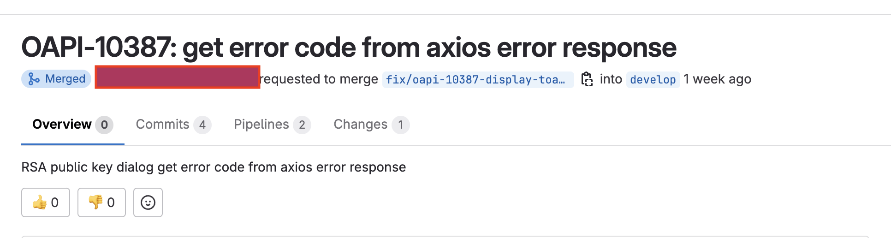
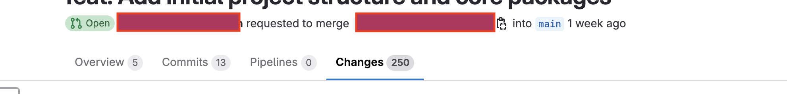

---
# You can also start simply with 'default'
theme: bricks
# random image from a curated Unsplash collection by Anthony
# like them? see https://unsplash.com/collections/94734566/slidev
# background: https://cover.sli.dev
# some information about your slides (markdown enabled)
title: PR-Agent
info: |
  ## PR-Agent is an AI-powered tool that streamlines pull request reviews
  
class: text-center
# https://sli.dev/features/drawing
drawings:
  persist: false
# slide transition: https://sli.dev/guide/animations.html#slide-transitions
transition: slide-left
# enable MDC Syntax: https://sli.dev/features/mdc
mdc: true
---

# AI Code Review, Smarter , Faster , Better

  <a href="https://github.com/qodo-ai/pr-agent" target="_blank" class="slidev-icon-btn">
    <carbon:logo-github />
  </a>

---

# What is the issue with the pull request?

this is the issue with the pull request

<v-clicks>

- <b v-mark.orange="1">Time</b> Reviewing PRs takes time

- <b v-mark.orange="2">Suggestions</b> Providing suggestions on PRs is time-consuming

- <b v-mark.orange="3">Description</b> Writing PR descriptions is time-consuming

- <b v-mark.orange="4">Improvements</b> Suggesting improvements on PRs is time-consuming

- <b v-mark.orange="5">Etc</b> conflicts, failing tests, code style
</v-clicks>

 

---

# For Example

Some usecase  pull request

<v-switch>
  <template #1>
  
  
   </template>
  <template #2>
  
  </template>
  <template #3>
  

  

 

  </template>
</v-switch>

---

# What is PR-Agent?

 

PR-Agent is an open-source tool to help efficiently review and handle pull requests. Qodo Merge is a hosted version of PR-Agent,
designed for companies and teams that require additional features and capabilities

Providing

- 📝 **Automated** - Automated feedback and suggestions
- 🎨 **Description** - PR description generation
- 🧑‍💻 **Improve** - Code suggestions for improving the PR
- 🛠 **Ask** - Answering free-text questions about the PR, or on specific code lines
 

 

Read more about [What PR-agent?](https://qodo-merge-docs.qodo.ai/)

---

  <h2>Demo</h2>

---

  <h2>Q/A</h2>

